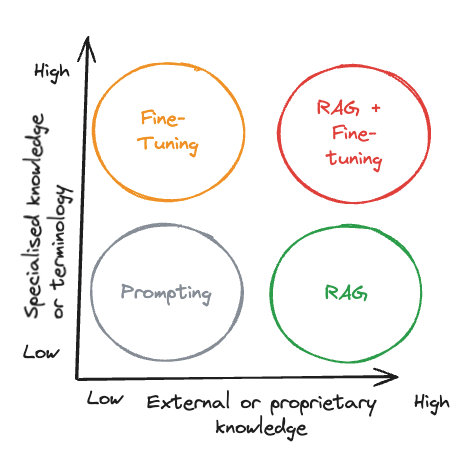

Retrieval-Augmented Generation (RAG) seems to be the new cool thing in the fast-changing world of generative AI, especially in language models.

I've been really getting into [LlamaIndex](https://www.llamaindex.ai/) lately, and I've noticed that sometimes the answers my apps give aren't as good as I'd like. Is it because of how I made the app, or should I try fine-tuning instead? Maybe I just need to use more specific and better prompts? I've decided to dig deeper into this.

Hopefully, I can share some insights for others wondering about the same thing.

## Use Cases

### RAG

RAG is particularly suited for applications that require dynamic, up-to-date information or access to external knowledge or proprietary sources. It combines a retrieval mechanism with a generative model, fetching relevant information from a database or document collection before generating a response. This makes RAG ideal for:

- Open-domain question answering, where the model needs to pull information from vast, unstructured data sources.
- Document summarisation, where key points from extensive documents are condensed, leveraging external knowledge for accuracy.
- Chatbots that provide information from a knowledge base, offering precise answers based on the latest data.

### Fine-Tuning

Fine-tuning, on the other hand, involves adjusting a pre-trained model's weights on a specific dataset to tailor it for a particular task or domain. This approach is well-suited for:

- Domain-specific applications, where the model needs to understand and generate text that aligns with specialised knowledge or terminology.
- Sentiment analysis, text classification, and language translation, where the model's general capabilities are refined to perform these tasks with higher accuracy.
- Customising the model's behaviour, writing style, or domain-specific knowledge to align with specific nuances, tones, or terminologies.

## Pros and Cons

### RAG

**Pros:**

- **Dynamic Data Handling:** RAG excels with dynamic, up-to-date data, making it suitable for applications requiring current information.
- **Transparency and Trust:** By retrieving information before generating a response, RAG offers a level of transparency and trust, as the source of information is clear.
- **Reduced Hallucinations:** RAG minimises the likelihood of generating inaccurate or fabricated responses by grounding each response in retrieved evidence.

**Cons:**

- **Complex Implementation:** As I am finding out, setting up an efficient, scalable and effective retrieval mechanism can be challenging.
- **Potential for Irrelevant Information:** If the retrieval mechanism is not accurate, it can inject irrelevant information into the response.

### Fine-Tuning

**Pros:**

- **Customisation:** Allows deep alignment with specific styles, expertise areas, or domain-specific knowledge.
- **Improved Model Effectiveness:** Fine-tuning can significantly enhance a model's performance on the targeted task or domain.
- **Easier than you think:** You can fine-tune a model in less time, with less data and with fewer resources than you've been led to believe.

**Cons:**

- **Less Dynamic:** Fine-tuning a model takes some know-how and the data needs to be in a very specific format, making it more time-consuming and labour-intensive.
- **Risk of Overfitting:** Fine-tuning incorrectly can lead to overfitting, where the model performs well on the training data but poorly on new, unseen data.

## Best Practices

- **Assess Your Data and Goals:** Choose RAG if your application relies heavily on external, dynamic data sources. Opt for fine-tuning if you need to deeply customise the model for a specific task or domain.
- **Combine Approaches When Necessary:** In some cases, using both RAG and fine-tuning can offer the best of both worlds, leveraging external knowledge while customising the model's behaviour for specific tasks.
- **Monitor and Update:** Both RAG and fine-tuning require ongoing monitoring and updates to maintain performance and relevance, especially as new data becomes available.
