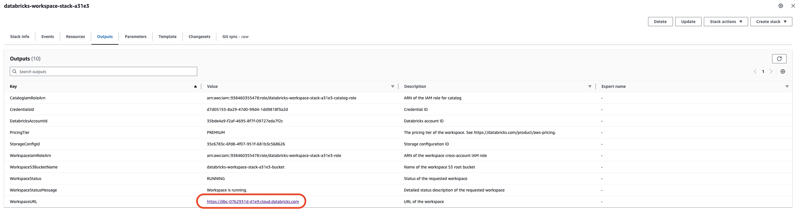
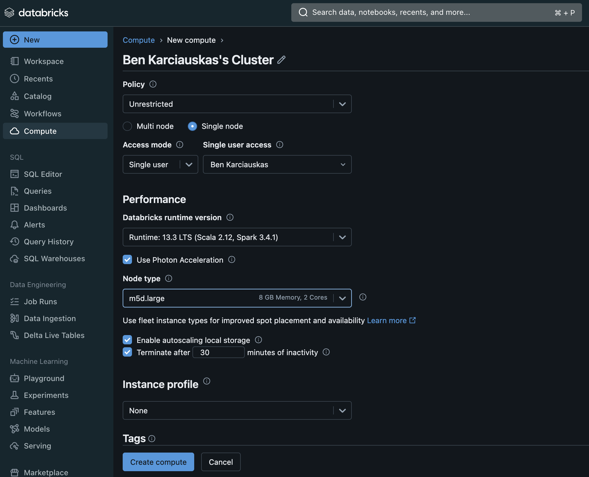
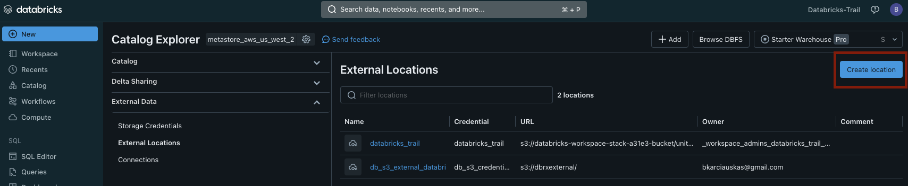
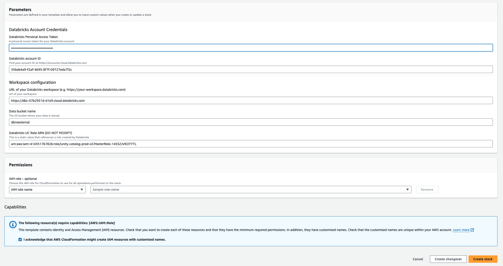
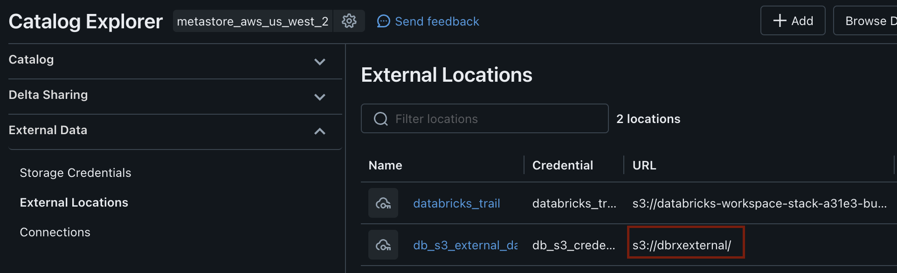
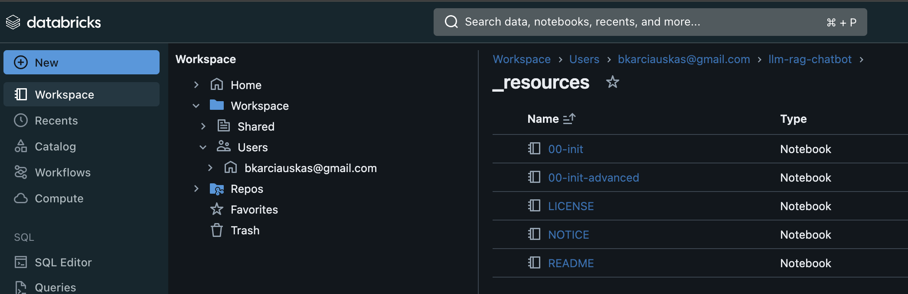

## Introduction

I recently setup and have been playing around with the ["Deploy LLM Chatbots with RAG and Databricks Vector Search"](https://www.databricks.com/resources/demos/tours/deploy-llm-chatbots-rag-and-databricks-ai-vector-search?itm_data=demo_center) demo from Databricks. While not a complete step-by-step guide, this article offers insights into what to expect, the necessary steps, how to fix issues that may arise, and how to maximize your trial experience quickly.

## Getting access to Databricks

You can get a free 2-week trial from Databricks. I used AWS, and if you want to follow along, you will need to do the same. Here are the main things to know for setting up the trial.

- While the Databricks platform is free to use for the trial, any resources you use, like EC2 instances for running clusters or S3 for external storage, will be billed directly by AWS.
- You will probably spend around $2-5 per day, depending on how long you explore and experiment with the platform.
- When you sign up at [https://www.databricks.com/try-databricks#account](https://www.databricks.com/try-databricks#account), you provide some personal details and then select your cloud provider, in this case AWS.
- You can use a personal email (I did), even though it recommends a business email.
- Be sure to have your AWS account details handy because once you complete the signup, you will get a link to a CloudFormation template which will launch the AWS console.
- The CloudFormation template requires you to provide a name for the Workspace. Most importantly, it will ask for a deployment region. Choose one of the following regions: ap-southeast-2, eu-west-1, us-east-1, us-east-2, or us-west-2. These are the only regions with the VectorStore preview, which the demo requires.
- It takes about 5 minutes to deploy, and once that is done, click "Outputs," and it will give you a link to the Databricks console. Log in using your Databricks login details.



## Configuring the environment

The configuration of the demo is reasonably straightforward. You only need to run a couple of lines of Python code in a Databricks notebook. However, to run the code, you will need to create a new notebook. But to run the notebook, you will need to create a cluster, so let's do that first.

## Creating a Temporary Cluster

In the Databricks interface click the Compute tab -> Create Compute. As this is only going to be used to run the setup script, you can make the cluster quite small. Make the following changes to the defaults.

- Change to a "Single Node"
- Change node type to m5d.large
- Set the termination time to 30 mins or less.

Create the cluster. It will take around 5 minutes to be available for use.



## Creating an External Storage Location

Next we will create an external storage location. This is required as part of the solution to avoid the following error you will get when going through the demo.

```
ERROR encountered when running init script

MetaStore storage root URL does not exist. Please provide a storage location for the catalog (for example 'CREATE CATALOG myCatalog MANAGED LOCATION '<location-path>'). Alternatively set up a metastore root storage location to provide a storage location for all catalogs in the metastore.
```

To create the storage location go to Catalog -> External Locations -> Create location and choose the AWS Quickstart option.



The quick start wizard requires the following:

- An AWS S3 bucket (you will need to create one if you haven't already)
- Create a personal access token which you create as part of the setup wizard
- A CloudFormation template will launch where you can enter the S3 bucket name and the Personal Access Token.



Once the template has finished creating the storage location it will be visible in Databricks. You will need to copy the URL for your storage location URL (reference the image below) as we need it when we fix some code in the demo script shortly.



## Deploying the Chatbots with RAG & Vector Search Demo

We are finally ready to deploy the demo. To do so, create a new notebook and attach it to the cluster you created earlier. Copy and paste the below code and run it.

```python
%pip install dbdemos

import dbdemos
dbdemos.install('llm-rag-chatbot', catalog='main', schema='rag_chatbot')
```

The installation will download all the workbooks with all the required code, and it will also create and start a cluster that needs to be used as part of the demo. By default, the cluster is named `dbdemos-llm-rag-chatbot-YourUserName` set to terminate after 120 minutes of inactivity, but it is worth reducing that to 30 minutes to save on costs.

## Update the 00-init setup file to use the external storage

Before running through the demo workbooks you need to update the 00-init file. It's located in the `llm_rag_chatbot/_resources` folder that was created in your workspace when you setup the demo.



Open `00-init` and replace the code in cell 8 with the code below. You need to replace `'s3://dbrxexternal/'` on line 1 with the name of your external storage location url you created earlier.

```python
storage_path = 's3://dbrxexternal/'

def use_and_create_db(catalog, dbName, cloud_storage_path=None):
    print(f"USE CATALOG `{catalog}`")
    spark.sql(f"USE CATALOG `{catalog}`")
    spark.sql(f"""CREATE CATALOG IF NOT EXISTS {catalog} MANAGED LOCATION '{storage_path}'""") # Specify the storage location

    spark.sql(f"""CREATE DATABASE IF NOT EXISTS `{dbName}` """)

assert catalog not in ['hive_metastore', 'spark_catalog']
# If the catalog is defined, we force it to the given value and throw an exception if not.
if len(catalog) > 0:
    current_catalog = spark.sql("SELECT current_catalog()").collect()[0]['current_catalog()']
    if current_catalog != catalog:
        catalogs = [r['catalog'] for r in spark.sql("SHOW CATALOGS").collect()]
        if catalog not in catalogs:
            spark.sql(f"CREATE CATALOG IF NOT EXISTS {catalog} MANAGED LOCATION '{storage_path}'")
        if catalog == 'dbdemos':
            spark.sql(f"ALTER CATALOG {catalog} OWNER TO `account users`")
        use_and_create_db(catalog, dbName)

if catalog == 'dbdemos':
    try:
        spark.sql(f"GRANT CREATE, USAGE ON DATABASE {catalog}.{dbName} TO `account users`")
        spark.sql(f"ALTER SCHEMA {catalog}.{dbName} OWNER TO `account users`")
    except Exception as e:
        print("Couldn't grant access to the schema to all users:" + str(e))

print(f"Using catalog.database `{catalog}`.`{dbName}`")
spark.sql(f"""USE `{catalog}`.`{dbName}`""")
```

Once you have done that you should be good to start running through the demos. They are quite detailed and it's worth taking the time to go through it slowly and understand what is happening and why. Enjoy!
