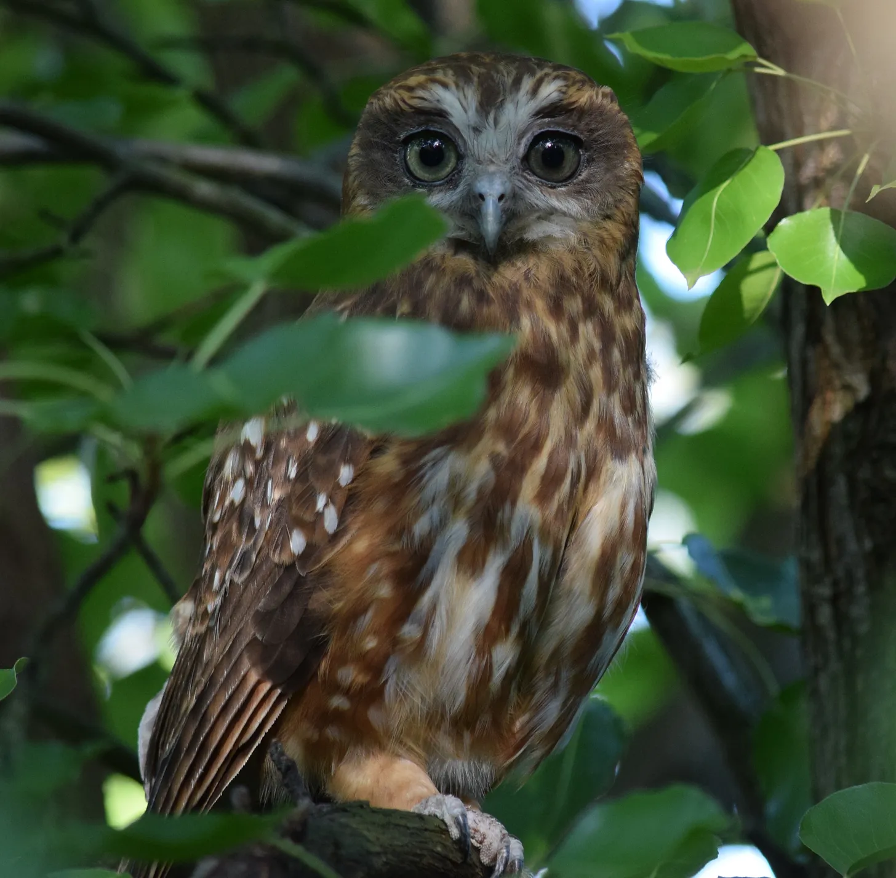
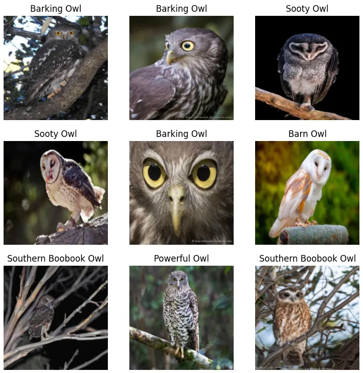

Recently, three owls decided to make their home in our garden. It's been a hoot (sorry, had to) getting to know these fascinating creatures. My fascination with them sparked the idea for my first ever machine learning application.

I had spent the last month or so working my way through the ["Practical Deep Learning for Coders"](https://course.fast.ai/) course by Fastai. The field seemed daunting, with its complex mathematical underpinnings and the perception that only tech giants like Google and Facebook could harness its power. However, as I progressed through the course, I discovered that many of my preconceptions were unfounded.

Here are some of the most surprising insights I gained while completing the course and building my owl classification model:

## You don't need a PhD in mathematics

While deep learning indeed involves advanced mathematical concepts, you don't need to be a maths prodigy to get started. The course emphasised that you can build useful models without fully grasping all the underlying mathematics from the outset. As you progress, you can learn the necessary concepts as needed, allowing you to focus on practical applications first.

I was able to build, train, and use my owl classification app in under an hour with zero mathematics.

## You don't need huge amounts of data

One of the biggest misconceptions I had was that deep learning required massive datasets, accessible only to large corporations. I was amazed to discover that I could train my own owl classification model using just a few hundred images downloaded from the internet. The course provided numerous examples demonstrating that practical models can be built with relatively small datasets.

## You don't need expensive supercomputers

Another revelation was that deep learning doesn't always require top-of-the-line hardware. Useful models can be trained in minutes on single GPU systems. My owl classification application took only a few minutes to train on a single T4 GPU.

On a side note, [Answer.ai](https://www.answer.ai/posts/2024-03-06-fsdp-qlora.html) recently released source code that allows you to train a 70-billion parameter language model at home using commodity GPUs. While there are some caveats — it's still early days — the fact that we can now train state-of-the-art models on accessible hardware is truly mind-blowing.

## Neural networks are not as complicated as I thought

At its most basic level, a neural network involves multiplying values together, summing them up, and then applying a threshold to determine which values are passed to the next layer. While there's certainly more to it, understanding this fundamental process made neural networks feel much more approachable.

## You can build deep learning models with surprisingly little code

As someone with a basic understanding of Python, I was relieved to find that the deep learning world primarily uses this language. However, I was still surprised by how little code was required to get started and build something useful. For example, once I had the training data, training and testing my owl classification model took less than 10 lines of code. This realisation was empowering and encouraged me to dive deeper into the practical applications of deep learning.

## Conclusion

My journey through the course has been eye-opening. It has shattered many of the myths and misconceptions I held about deep learning, making it feel more accessible and achievable.

While there is still much to learn, the satisfaction of creating something novel that bridged my work, hobby, and home life was incredibly fulfilling. It has motivated me to continue developing my ML skills and find new problems to solve. Who knows what I'll build next!
