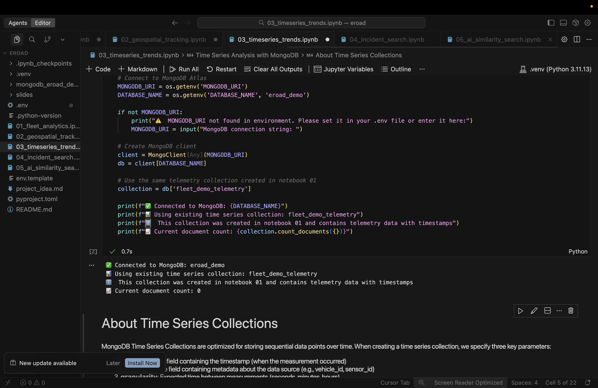

#### Discover seamless code exploration—and what to expect—when using Jupyter workflows inside Cursor

When I first stumbled upon Jupyter Notebook support in Cursor, it was hard to get genuinely excited—my early attempts were honestly pretty clunky. Editing .ipynb files felt unreliable, and the workflow didn't quite "click" the way a true notebook should. I kept bouncing between clumsy interfaces, and it didn't feel worth the hassle. But recently, something changed. I'm not sure exactly when the update landed, but suddenly, working in notebooks inside Cursor is not just possible, but actually a pleasure.

### Iteration Made Easy—and Fast

The magic of notebooks is getting instant feedback on every cell. Inside Cursor, you now simply write your Python code in .py files, breaking your work into cells with simple `# %%` markers. Run a cell and see the output right below—it's a direct, visual loop of write, run, and learn. You can tweak one line and rerun just that cell. The context (variables, imports, results) stays visible, eliminating the constant window-flipping that can stall curiosity or creativity.

This setup is a perfect recipe for learning: you can test new libraries, debug algorithms, or explore data analysis workflows step by step. When something breaks, locating the error and fixing it in context is as easy as rerunning a single cell—no need to reprocess your whole script or guess which bit of code is causing trouble.

### Supercharged by AI

What really takes things up a notch is Cursor's built-in AI. Highlight a block of code, open the AI chat, and get instant explanations or suggestions for improvements. Ask for markdown summaries or error fixes—Cursor generates responses contextually, sometimes adding them right in-line upon approval. This accelerates the "learn by doing" workflow that makes notebooks so addictive.

### Limitations And Quirks

It is not without issues. These are what I discovered during initial playing around.

- Needs manual kernel selection
- Can't see or manage kernels easily
- Limited interactive widget support
- Plotly interactivity may be reduced
- Image output via IPython.display works
- No visual cell execution state (no "running" badge or spinner)
- Can't clear output without re-running

### Why It's Worth It

- **Rapid Experimentation:** See outputs instantly, fix errors as you go, and never lose track of your logic chain.
- **AI Superpowers:** Quick explanations, instant markdown generation, code tips—right in your editor.
- **Seamless Prototyping:** Whether you're exploring new libraries or running data pipelines, you can treat your notebook like both a sandbox and a launchpad.
- **Easier Sharing:** With everything as human-readable Python, version control and collaboration get simpler and cleaner.

### Takeaway

If you've tried Jupyter in Cursor before and walked away frustrated, now is the right time to try again. The latest updates make iterative learning and prototyping not only possible but truly enjoyable. Even with a few quirks, this combo makes experimentation, debugging, and learning move faster than ever.
